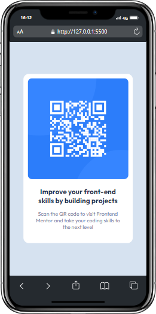

# Frontend Mentor - QR code component solution

This is a solution to the [QR code component challenge on Frontend Mentor](https://www.frontendmentor.io/challenges/qr-code-component-iux_sIO_H). Frontend Mentor challenges help you improve your coding skills by building realistic projects. 

## Table of contents

- [Overview](#overview)
  - [Screenshot](#screenshot)
  - [Links](#links)
- [My process](#my-process)
  - [Built with](#built-with)
  - [What I learned](#what-i-learned)
  - [Continued development](#continued-development)
  - [Useful resources](#useful-resources)
- [Author](#author)
- [Acknowledgments](#acknowledgments)

## Overview
Desktop

### Screenshot
Mobile

### Links

- Solution URL: [Add solution URL here](https://your-solution-url.com)

## My process

### Built with

- Semantic HTML5 markup
- CSS custom properties
- Flexbox
- CSS Grid
- Mobile-first workflow

### Continued development

I want to keep foucusing on how to use grid and more complex CSS properties to perform better my skills

### Useful resources

- [Example resource 1](https://chromewebstore.google.com/detail/simulador-m%C3%B3vil-herramien/ckejmhbmlajgoklhgbapkiccekfoccmk) - This google chorome extension helped me to loot at the final view of the challenge, to see how it looks like in mobile.

## Author

- Frontend Mentor - [@yourusername](https://www.frontendmentor.io/profile/2VOLTAIC3)
- Instagram - [@yourusername](https://www.instagram.com/joancardenas11/#)
- GitHub- [@yourusername](https://github.com/2VOLTAIC3)

## Acknowledgments

My deepest thanks to Front-end Mentor for this challenge.

